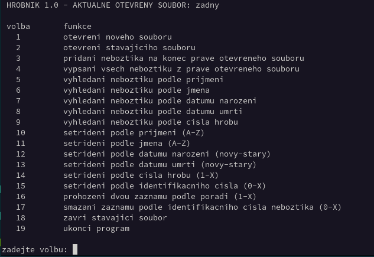

# Hrobník 2.0
Program určený ke správě hřbitova!

Semestrální práce z roku 2002 (ČVUT FEL). Původně určeno pro Borland Pascal 7.0 (MS-DOS).

### Poznámka z roku 2025
Textovou verzi 1.0 lze stále zkompilovat použitím [Free Pascal](https://www.freepascal.org/) kompilátoru (fpc). 

```shell
zypper in fpc
git checkout tags/v1.0
fpc -vut hrobnik.pas
```

<br>
Pro grafickou verzi 2.0 to už bohužel není možné z důvodu již nepodporovaného modulu (unit) GRAPH.
